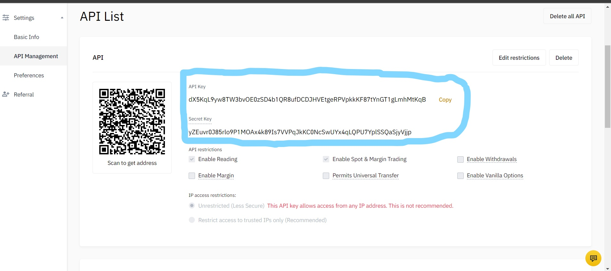

<!--
*** Thanks for checking out the Best-README-Template. If you have a suggestion
*** that would make this better, please fork the repo and create a pull request
*** or simply open an issue with the tag "enhancement".
*** Thanks again! Now go create something AMAZING! :D
-->


<!-- PROJECT SHIELDS -->
<!--
*** I'm using markdown "reference style" links for readability.
*** Reference links are enclosed in brackets [ ] instead of parentheses ( ).
*** See the bottom of this document for the declaration of the reference variables
*** for contributors-url, forks-url, etc. This is an optional, concise syntax you may use.
*** https://www.markdownguide.org/basic-syntax/#reference-style-links
-->

<!-- PROJECT LOGO -->
<br />
<p align="center">
  <a href=" HassanRaza1313/Bitcoin-Trading-Bot-Using-LSTM (github.com)">
    
  </a>

  <h3 align="center">Bitcoin Trading Bot Using LSTM</h3>

  <p align="center">
    - A Real-Time Bitcoin Trading Bot
    <br />
  </p>
</p>


<!-- TABLE OF CONTENTS -->
<details open="open">
  <summary>Table of Contents</summary>
  <ol>
    <li>
      <a href="#about-the-project">About The Project</a>
      <ul>
        <li><a href="#built-with">Built With</a></li>
      </ul>
    </li>
    <li>
      <a href="#getting-started">Getting Started</a>
      <ul>
        <li><a href="#prerequisites">Prerequisites</a></li>
      </ul>
    </li>
    <li><a href="#usage">Usage</a></li>
    <li><a href="#license">License</a></li>
    <li><a href="#contact">Contact</a></li>
  </ol>
</details>


<!-- ABOUT THE PROJECT -->
## About The Project

A bitcoin trading bot that is trained on live dataset from Binance using the Binance API. The bot is trained on the live data using LSTM Deep Learning and uses that prediction to make its move in the market. The bot is capable of both buying and selling Bitcoin according to the situation of the market. The bot is also capable of transfer learning in order to improve its accuracy.

### Built With

* [NumPy](https://numpy.org/)
* [Pandas](https://pandas.pydata.org/)
* [Matplotlib](https://matplotlib.org/)
* [Scikit-learn](https://scikit-learn.org/)
* [Keras](https://keras.io/)


<!-- GETTING STARTED -->
## Getting Started

* Clone the repo or download the zip folder to your local machine.
* Install Python and all dependencies on your machine.
* Train your model using the "Training Using LSTM" notebook.
* Using that model, you can trade on your Binance account through the "Trading" notebook.


### Prerequisites

First of all, you need a binance account to trade on the platform. Sign up on: 

```sh
  https://accounts.binance.com/en/register?return_to=aHR0cHM6Ly93d3cuYmluYW5jZS5jb20vZW4=
  ```
  
Fill in the required details, do all the necesssary authentication and you are good to go!

After that, Create the Binance API for your account. In your account settings, go to API Management, label your API, and press Create. 


After you complete all verification and create your API, you will get the following screen:


This API Key and Secret Key are the essentials required to use the Binance API in Python. Store them on a safe file (NOTE: THE SECRET KEY IS ONLY DISPLAYED ONCE WHEN THE API
IS CREATED. STORE IT IN AN EXTERNAL FILE AS IT WILL NOT BE SHOWN AGAIN.)

Once you have completed all the steps above, you have setup your Binance Account and API and are ready to run your trading bot! 
In order to run this bot on your python environment, run the following lines on your Python/Anaconda command line to install the required dependencies:
```sh
 pip install numpy
 pip install pandas
 pip install matplotlib
 pip install scikit-learn
 pip install Keras
 pip install python-binance
  ```
Once you install all the dependencies, open the Jupyter Notebook, run the bot and start trading!

<!-- USAGE EXAMPLES -->
## Usage
Displaying the Candlesticks data loaded from Binance API:


Standardizing the dataset and loading the dataset into a Pandas Dataframe:


Tuning the hyperparameters and compiling the training model


Tuning the hyperparameters and compiling the training model


Evaluating the accuracy of the model:


Using the trading model to trade real-time on the Binance Platform:


<!-- LICENSE -->
## License

Distributed under the MIT License. See `LICENSE` for more information.


<!-- CONTACT -->
## Contact

Hassan Raza - [https://www.linkedin.com/in/hassan-raza-mahmood/](https://www.linkedin.com/in/hassan-raza-mahmood/) - hassanraza999@hotmail.com

Project Link: [https://github.com/HassanRaza1313/Real-Time-Object-Detection-and-Distance-Measurement-Android](https://github.com/HassanRaza1313/Real-Time-Object-Detection-and-Distance-Measurement-Android)
